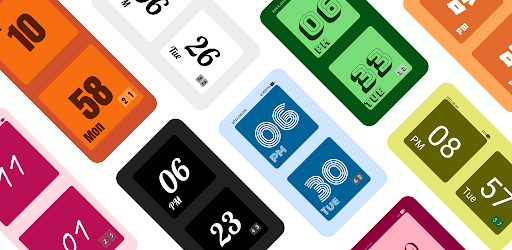

Make Your Special Clock.
Support Material You Design.
Support multiple color scheme.
Support multiple font family.
Support show battery.
Support show calendar.

Material You Compose 实践：多样式时钟

[Google Play 下载地址](https://play.google.com/store/apps/details?id=com.heinika.styleclock)

[github 源码地址](https://github.com/heinika/StyleClock)

## Talk is cheap. Show me the code.

首先确定主题样式的逻辑：

```kotlin
enum class Theme {
  DynamicTheme,
  DynamicLightTheme,
  DynamicDarkTheme,
  AutoTheme,
  LightTheme,
  DarkTheme,
  LightGreenTheme,
  DarkGreenTheme,
  LightBlueTheme,
  DarkBlueTheme,
  LightPinkTheme,
  DarkPinkTheme,
  LightOrangeTheme,
  DarkOrangeTheme,
  LightColorful2Theme,
  DarkColorful12heme,
  LightColorful1Theme,
  DarkColorful1Theme,
  LightPurpleTheme,
  DarkPurpleTheme;

  fun getColorScheme(darkTheme: Boolean, context: Context): ColorScheme = when (this) {
    DynamicTheme -> {
      if (Build.VERSION.SDK_INT >= Build.VERSION_CODES.S) {
        if (darkTheme) dynamicDarkColorScheme(context) else dynamicLightColorScheme(context)
      } else {
        if (darkTheme) DarkColors else LightColors
      }
    }
    AutoTheme -> {
      if (darkTheme) DarkColors else LightColors
    }
    LightTheme -> LightColors
    DarkTheme -> DarkColors
    LightGreenTheme -> LightGreenColors
    DarkGreenTheme -> DarkGreenColors
    LightBlueTheme -> LightBlueColors
    DarkBlueTheme -> DarkBlueColors
    DynamicLightTheme -> if (Build.VERSION.SDK_INT >= Build.VERSION_CODES.S) {
      dynamicLightColorScheme(context)
    } else {
      LightColors
    }
    DynamicDarkTheme -> if (Build.VERSION.SDK_INT >= Build.VERSION_CODES.S) {
      dynamicDarkColorScheme(context)
    } else {
      DarkColors
    }
    LightPurpleTheme -> LightPurpleColors
    DarkPurpleTheme -> DarkPurpleColors
    LightColorful1Theme -> LightColorful1Colors
    DarkColorful1Theme -> DarkColorful1Colors
    LightColorful2Theme -> LightColorful2Colors
    DarkColorful12heme -> DarkColorful2Colors
    LightPinkTheme -> LightPinkColors
    DarkPinkTheme -> DarkPinkColors
    LightOrangeTheme -> LightOrangeColors
    DarkOrangeTheme -> DarkOrangeColors
  }
}
```

应用相关主题：

```kotlin
@Composable
fun PureClockTheme(
  theme: Theme = Theme.DynamicTheme,
  darkTheme: Boolean = isSystemInDarkTheme(),
  content: @Composable () -> Unit
) {
  val colorScheme = theme.getColorScheme(darkTheme, LocalContext.current)

  val view = LocalView.current
  if (!view.isInEditMode) {
    SideEffect {
      (view.context as Activity).window.statusBarColor = colorScheme.primary.toArgb()
      ViewCompat.getWindowInsetsController(view)?.isAppearanceLightStatusBars = darkTheme
    }
  }

  MaterialTheme(
    colorScheme = colorScheme,
    typography = Typography,
    content = content
  )
}
```


## 控制横竖屏旋转

通过 BoxWithConstraints 获取宽度和高度，从而灵活布局：

```kotlin
BoxWithConstraints {
    if (maxWidth > maxHeight) {
       //横屏代码
    } else {
       //竖屏代码
    }
}
```


## 使用 ViewModel 控制数据

```kotlin
val theme by viewModel.theme.collectAsState(initial = Theme.DynamicTheme)
val fontFamily by viewModel.fontFamily.collectAsState(initial = MyFontFamily.DefaultFontFamily)
val hour by viewModel.hour.observeAsState()
val minute by viewModel.minute.observeAsState()
val second by viewModel.second.observeAsState()
val amPm by viewModel.amPm.observeAsState()
val dayOfWeek by viewModel.dayOfWeek.observeAsState()
val powerPct by viewModel.powerPct.observeAsState()
val isCharging by viewModel.isCharging.observeAsState()
val formatDate by viewModel.formatDate.observeAsState()
val isShowBatteryPower by viewModel.isShowBatteryPower.collectAsState(initial = false)
val isShowCalendar by viewModel.isShowCalendar.collectAsState(initial = false)
```


## 源码地址

[github 源码地址](https://github.com/heinika/StyleClock)

[Google Play 下载地址](https://play.google.com/store/apps/details?id=com.heinika.styleclock)